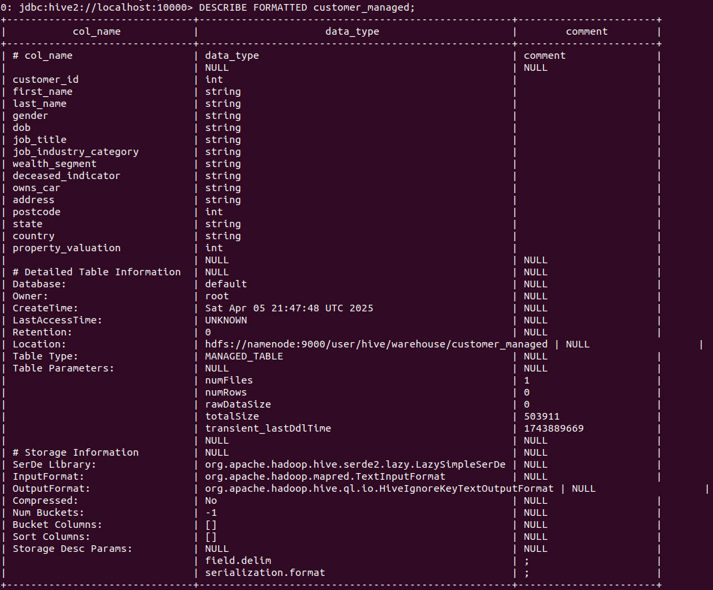
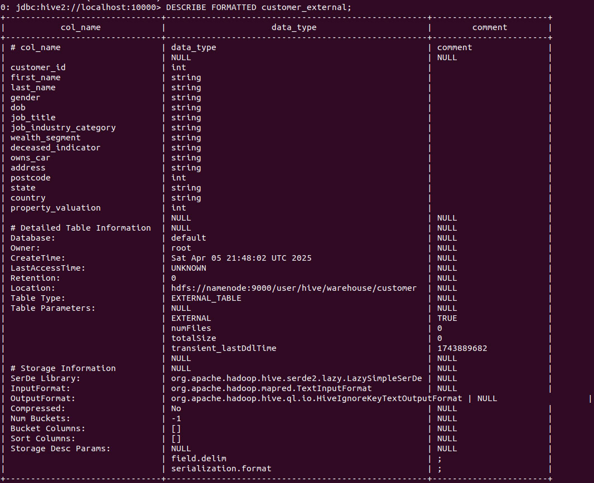
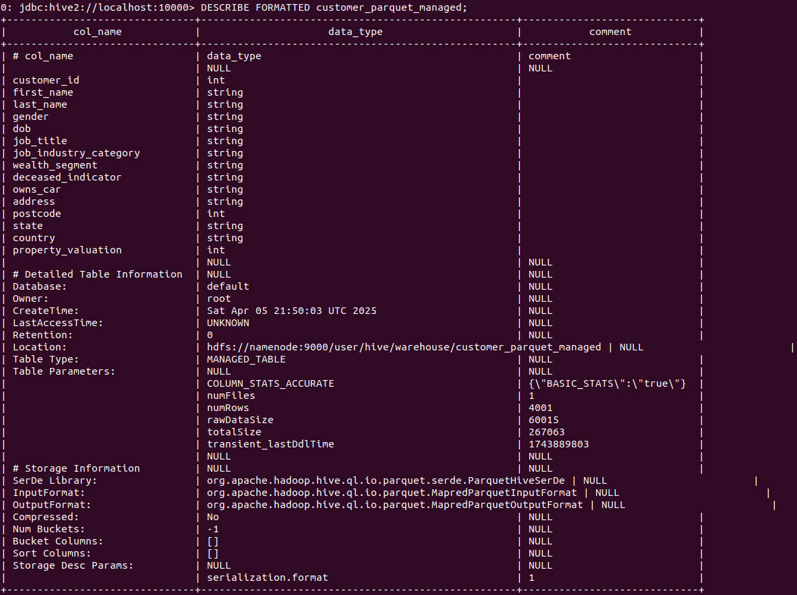
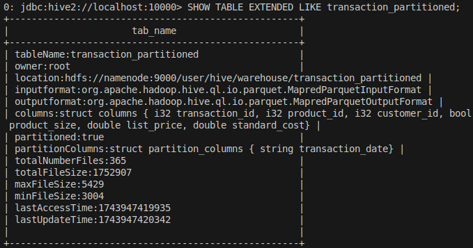
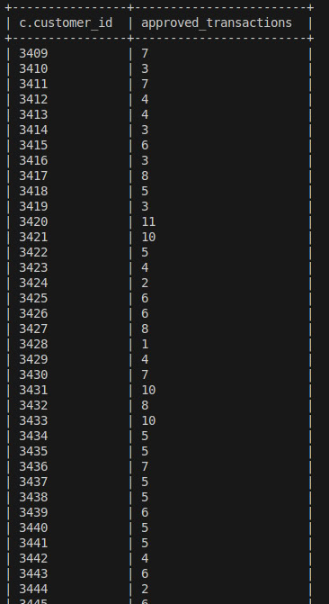
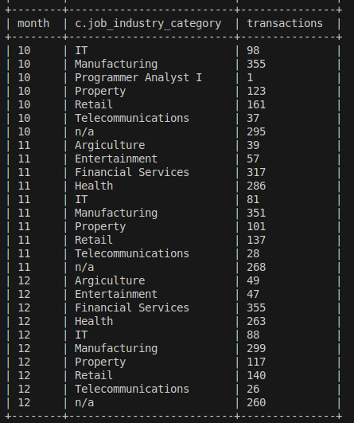
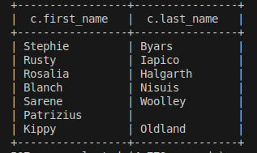
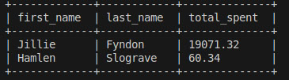
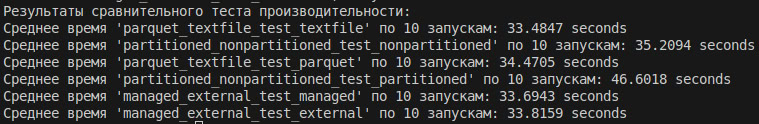

Возьмем уже готовую реализацию docker-compose (см. submodule) и запустим ее:
```
cd docker-hadoop-spark
docker-compose up -d
```

Далее, положим .csv файлы в docker контейнер hive-server:
```
docker cp ../data/transaction.csv hive-server:/home
docker cp ../data/customer.csv hive-server:/home
```

А затем загрузим их в hdfs (с копией для managed таблиц, т.к. "LOAD DATA INPATH" вызовет их перемещение):
```
docker-compose exec hive-server bash
hdfs dfs -mkdir hdfs://namenode:9000/user/hive/warehouse/transaction/
hdfs dfs -mkdir hdfs://namenode:9000/user/hive/warehouse/transaction_managed/
hdfs dfs -mkdir hdfs://namenode:9000/user/hive/warehouse/customer/
hdfs dfs -mkdir hdfs://namenode:9000/user/hive/warehouse/customer_managed/
hdfs dfs -put /home/transaction.csv hdfs://namenode:9000/user/hive/warehouse/transaction/
hdfs dfs -put /home/transaction.csv hdfs://namenode:9000/user/hive/warehouse/transaction_managed/
hdfs dfs -put /home/customer.csv hdfs://namenode:9000/user/hive/warehouse/customer/
hdfs dfs -put /home/customer.csv hdfs://namenode:9000/user/hive/warehouse/customer_managed/
```

Подключимся к Hive:
```
beeline -u jdbc:hive2://localhost:10000
```

Создадим managed и external таблицы на базе CSV, сначала managed:
```
CREATE TABLE customer_managed (
    customer_id INT,
    first_name STRING,
    last_name STRING,
    gender STRING,
    DOB STRING,
    job_title STRING,
    job_industry_category STRING,
    wealth_segment STRING,
    deceased_indicator STRING,
    owns_car STRING,
    address STRING,
    postcode INT,
    state STRING,
    country STRING,
    property_valuation INT
)
ROW FORMAT DELIMITED
FIELDS TERMINATED BY ';'
STORED AS TEXTFILE;

LOAD DATA INPATH 'hdfs://namenode:9000/user/hive/warehouse/customer_managed/' INTO TABLE customer_managed;

CREATE TABLE transaction_managed (
    transaction_id INT,
    product_id INT,
    customer_id INT,
    transaction_date STRING,
    online_order BOOLEAN,
    order_status STRING,
    brand STRING,
    product_line STRING,
    product_class STRING,
    product_size STRING,
    list_price STRING,
    standard_cost STRING
)
ROW FORMAT DELIMITED
FIELDS TERMINATED BY ';'
STORED AS TEXTFILE;

LOAD DATA INPATH 'hdfs://namenode:9000/user/hive/warehouse/transaction_managed/' INTO TABLE transaction_managed;
```

, а затем external:
```
CREATE EXTERNAL TABLE customer_external (
    customer_id INT,
    first_name STRING,
    last_name STRING,
    gender STRING,
    DOB STRING,
    job_title STRING,
    job_industry_category STRING,
    wealth_segment STRING,
    deceased_indicator STRING,
    owns_car STRING,
    address STRING,
    postcode INT,
    state STRING,
    country STRING,
    property_valuation INT
)
ROW FORMAT DELIMITED
FIELDS TERMINATED BY ';'
STORED AS TEXTFILE
LOCATION 'hdfs://namenode:9000/user/hive/warehouse/customer/';

CREATE EXTERNAL TABLE transaction_external (
    transaction_id INT,
    product_id INT,
    customer_id INT,
    transaction_date STRING,
    online_order BOOLEAN,
    order_status STRING,
    brand STRING,
    product_line STRING,
    product_class STRING,
    product_size STRING,
    list_price STRING,
    standard_cost STRING
)
ROW FORMAT DELIMITED
FIELDS TERMINATED BY ';'
STORED AS TEXTFILE
LOCATION 'hdfs://namenode:9000/user/hive/warehouse/transaction/';
```

Проверим "Table Type" свойство у каких-нибудь созданных таблиц, например, у customer_managed и customer_external:


, как видим, Table Type свойство соответствует ожидаемым.

Теперь создадим managed таблицы в формате Parquet (как выяснится в дальнейшем, managed / extrernal свойство не влияет на перфоманс операций, а external таблицу не получится создать простой заливкой из другой таблицы -- Hive ведь хочет знать место хранения таких таблиц):
```
CREATE TABLE customer_parquet
STORED AS PARQUET
AS SELECT * FROM customer_managed;

CREATE TABLE transaction_parquet
STORED AS PARQUET
AS SELECT * FROM transaction_managed;
```

Проверим "InputFormat" свойство у какой-нибудь созданной таблицы, например, у customer_parquet, и убедимся что формат хранения соответствует Parquet типу:

, как видим, InputFormat свойство соответствует ожидаемым.

Далее, распартиционируем таблицу транзакций, после чего приведем transaction_date атрибут к требуемому формату, а затем к строковому типу (иначе партиции будут плохо отображаться в файловой системе), скастим STRING поля к DOUBLE. Также, увеличим дефолтное количество возможных партиций, т.к. их по дефолту 100, и когда появляется необходимость увеличить их количество (дней в transaction_date близкое к 365 количество), MR-таска падает. Кроме того, выделим побольше памяти для того чтобы garbage collector не падал с превышением памяти (все-таки партиций слишком много, и дефолтного количества ресурсов не хватает). Все это сохраним в Parquet-никах (как поймем далее, формат parquet / textfile почти никак не влияет на производительность в данном случае, поэтому в других форматах сохранять не будем, только в данном):
```
CREATE TABLE transaction_partitioned (
    transaction_id INT,
    product_id INT,
    customer_id INT,
    online_order BOOLEAN,
    order_status STRING,
    brand STRING,
    product_line STRING,
    product_class STRING,
    product_size STRING,
    list_price DOUBLE,
    standard_cost DOUBLE
)
PARTITIONED BY (transaction_date STRING)
STORED AS PARQUET;

SET hive.exec.dynamic.partition.mode = nonstrict;
SET hive.exec.max.dynamic.partitions = 400;
SET hive.exec.max.dynamic.partitions.pernode = 400;
SET mapreduce.map.java.opts = "-Xmx4096m -XX:-UseGCOverheadLimit";
SET mapreduce.reduce.java.opts = "-Xmx4096m -XX:-UseGCOverheadLimit";
SET mapreduce.map.memory.mb=4096;
SET mapreduce.reduce.memory.mb=4096;
SET yarn.app.mapreduce.am.resource.mb=4096;

INSERT INTO TABLE transaction_partitioned PARTITION (transaction_date)
SELECT 
    transaction_id,
    product_id,
    customer_id,
    online_order,
    order_status,
    brand,
    product_line,
    product_class,
    product_size,
    CASE 
        WHEN list_price RLIKE '^\\d+(\\.\\d+)?$' THEN CAST(list_price AS DOUBLE)
        ELSE NULL 
    END AS list_price,
    CASE 
        WHEN standard_cost RLIKE '^\\d+(\\.\\d+)?$' THEN CAST(standard_cost AS DOUBLE)
        ELSE NULL 
    END AS standard_cost,
    DATE_FORMAT(
        TO_DATE(FROM_UNIXTIME(UNIX_TIMESTAMP(transaction_date, 'dd.MM.yyyy'))), 
        'yyyy-MM-dd'
    ) AS transaction_date 
FROM transaction_managed;
```

Проверим "partitioned" и "partitionColumns" свойства у созданной таблицы:


Наконец, можно приступать к сравнению времени исоплнения. Будем делать по одной группе запросов для каждой пары сравнения (4 запроса сразу). Сначала посмотрим, правильно ли вообще мы их пишем, запустим и для customer_managed + transaction_managed пары, сначала посчитаем количество подтвержденных транзакций по клиентам:
```
SELECT c.customer_id, COUNT(t.transaction_id) AS approved_transactions
FROM customer_managed c
JOIN transaction_managed t ON c.customer_id = t.customer_id
WHERE t.order_status = 'Approved'
GROUP BY c.customer_id;
```



Потом найдем распределение транзакций по месяцам и сферам деятельности:
```
SELECT 
    SUBSTR(t.transaction_date, 4, 2) AS month,
    c.job_industry_category,
    COUNT(*) AS transactions
FROM transaction_managed t
JOIN customer_managed c ON t.customer_id = c.customer_id
GROUP BY SUBSTR(t.transaction_date, 4, 2), c.job_industry_category;
```



Далее выведем ФИО клиентов, у которых нет транзакций:
```
SELECT c.first_name, c.last_name
FROM customer_managed c
LEFT JOIN transaction_managed t ON c.customer_id = t.customer_id
WHERE t.transaction_id IS NULL;
```



И найдем клиентов с мин/макс суммой транзакций, воспользовавшись оконными функциями:
```
SELECT first_name,
       last_name,
       total_spent
FROM (
    SELECT c.first_name,
           c.last_name,
           SUM(CAST(t.list_price AS DOUBLE)) AS total_spent,
           MIN(SUM(CAST(t.list_price AS DOUBLE))) OVER () AS min_total,
           MAX(SUM(CAST(t.list_price AS DOUBLE))) OVER () AS max_total
    FROM customer_managed c
    JOIN transaction_managed t ON c.customer_id = t.customer_id
    WHERE t.list_price IS NOT NULL
    GROUP BY c.first_name, c.last_name
) x
WHERE total_spent = min_total OR total_spent = max_total;
```



Кажется, результаты запросов адекватные, и написаны они правильно. 

Теперь поступим так: разделим тесты на 3 группы - managed_external_test (над парами customer_managed + transaction_managed / customer_external + transaction_external), parquet_textfile_test (над парами customer_managed + transaction_managed / customer_parquet + transaction_parquet) и partitioned_nonpartitioned_test (над парами customer_parquet + transaction_parquet / customer_parquet + transaction_partitioned (для таблицы transaction_partitioned надо учесть, что дата теперь записывается немного по-другому)), пары .sql файлов можно найти в папке sql. Используем их для сравнения по каждому тесту, сначала загрузим все тесты командой:
```
docker cp ../sql hive-server:/home
```

Далее, запустим тесты:
```
hive -f /home/sql/managed_external_test/managed.sql > managed_external_test_managed.log 2>&1
hive -f /home/sql/managed_external_test/external.sql > managed_external_test_external.log 2>&1
hive -f /home/sql/parquet_textfile_test/parquet.sql > parquet_textfile_test_parquet.log 2>&1
hive -f /home/sql/parquet_textfile_test/textfile.sql > parquet_textfile_test_textfile.log 2>&1
hive -f /home/sql/partitioned_nonpartitioned_test/partitioned.sql > partitioned_nonpartitioned_test_partitioned.log 2>&1
hive -f /home/sql/partitioned_nonpartitioned_test/nonpartitioned.sql > partitioned_nonpartitioned_test_nonpartitioned.log 2>&1
```

Из файла, например, managed_external_test_managed.log, мы получаем информацию по времени отрабатывания всех 4-х запросов:
```
$ cat managed_external_test_managed.log | grep "Time taken"
Time taken: 9.811 seconds, Fetched: 3492 row(s)
Time taken: 7.399 seconds, Fetched: 127 row(s)
Time taken: 7.304 seconds, Fetched: 507 row(s)
Time taken: 8.574 seconds, Fetched: 2 row(s)
```

Нам же нужна их сумма, и так по каждому файлу с логами. Надо также учесть, что результат случайный, следовательно, лучше бы хоть как-то этот результат усреднить (усредним по 10-ти запускам), посчитать это для каждого теста можно таким скриптом:
```
#!/bin/bash

n=10

declare -A tests
tests["managed_external_test_managed"]="/home/sql/managed_external_test/managed.sql"
tests["managed_external_test_external"]="/home/sql/managed_external_test/external.sql"
tests["parquet_textfile_test_parquet"]="/home/sql/parquet_textfile_test/parquet.sql"
tests["parquet_textfile_test_textfile"]="/home/sql/parquet_textfile_test/textfile.sql"
tests["partitioned_nonpartitioned_test_partitioned"]="/home/sql/partitioned_nonpartitioned_test/partitioned.sql"
tests["partitioned_nonpartitioned_test_nonpartitioned"]="/home/sql/partitioned_nonpartitioned_test/nonpartitioned.sql"

final_summary="Результаты сравнительного теста производительности:"
for test in "${!tests[@]}"; do
  sql_file="${tests[$test]}"
  total_time=0
  echo "Запускаем тест '$test' используя SQL файл: $sql_file"
  for (( i=1; i<=n; i++ )); do
    current_log="${test}_${i}.log"
    hive -f "$sql_file" > "$current_log" 2>&1
    run_time=$(grep "Time taken:" "$current_log" | awk '{sum+=$3} END {print sum}')
    total_time=$(awk -v a="$total_time" -v b="$run_time" 'BEGIN {print a+b}')
    echo "    Тест '$test', запуск $i: $run_time seconds"
  done
  avg_time=$(awk -v total="$total_time" -v count="$n" 'BEGIN {print total/count}')
  final_summary+="\nСреднее время '$test' по $n запускам: $avg_time seconds"
done

echo -e "$final_summary"
```

Запустим его (также лежит в папке sql), и посмотрим на результат:
```
bash /home/fetch_tests.sh
```



Наконец, мы можем сделать финальные выводы по проделанному. Как видно из тестов, managed / external практически совсем не влияет на перфоманс операций. Что и логично, фактически просто путь хранения либо внутренний, либо экспортируемый, возможен разве что совсем небольшой оверхед на какие то дополнительные проверки, но это остается для выяснения дополнительными тестами. Далее, тест parquet_textfile показывает, что тип хранения parquet, на удивление, немного уступает типу textfile. Так происходит, наверное, из-за того, что данных слишком мало, и эффект от перехода к вертикальному чтению от горизонтального тут не проявляется. Наконец, тест partitioned_nonpartitioned показывает, что партиционирование в данном случае вредит перфомансу. Это происходит, наверное, из-за слишком малого размера партиций и большого их количества, вероятно, если уменьшить размер партиции, деградации производительности или не будет совсем, или она будет куда менее явной.

Напоследок, остановим контейнеры и удалим volume-ы:
```
docker-compose down -v
```